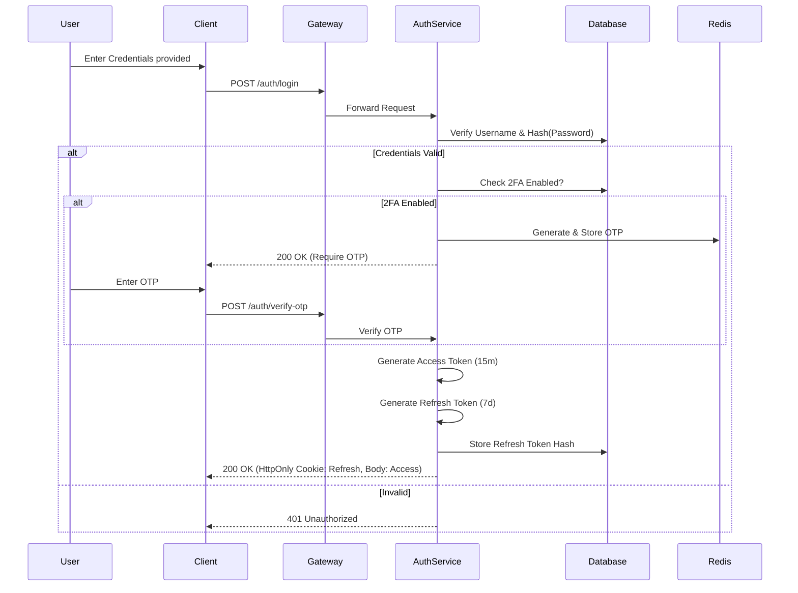

# SentinelX Security Architecture

This document outlines the comprehensive security architecture for the SentinelX banking platform, designed to meet enterprise-grade standards for authentication, authorization, data integrity, and compliance.

---

## 1. JWT Authentication System

We utilize a dual-token system (Access Token + Refresh Token) to balance security and user experience.

### **Authentication Flow**



### **Token Structure**

**Access Token (Payload)**

```json
{
  "sub": "usr_1234567890",
  "iss": "sentinelx-auth-service",
  "iat": 1678900000,
  "exp": 1678900900, // 15 minutes
  "role": "branch_manager",
  "branch_id": "br_ny_01",
  "permissions": ["loan:approve", "customer:read"],
  "jti": "a1b2c3d4e5...unique_id"
}
```

**Refresh Token**: Opaque string (cryptographically secure random 64-char hex), stored as a hash in the database.

### **Security Controls**

- **Storage**:
  - **Access Token**: In-memory (React Context/Redux) - _Prevents XSS permanent theft_.
  - **Refresh Token**: `HttpOnly`, `Secure`, `SameSite=Strict` Cookie - _Prevents XSS access_.
- **Rotation**: Refresh tokens are rotated on every use. Old tokens are instantly invalidated.
- **Blacklisting**: On logout, the Access Token JTI is added to a Redis blacklist until expiry.

---

## 2. Role-Based Authorization (RBAC)

We implement a hierarchical RBAC system with granular permission mapping.

### **Role Hierarchy**

- **Super Admin** (Global access)
- **Regional Manager** (Multi-branch access)
- **Branch Manager** (Single branch read/write)
- **Staff** (Single branch read/limited write)
- **Customer** (Own data only)

### **Database Schema (RBAC)**

```sql
CREATE TABLE roles (
    id UUID PRIMARY KEY,
    name VARCHAR(50) UNIQUE, -- 'branch_manager'
    description TEXT
);

CREATE TABLE permissions (
    id UUID PRIMARY KEY,
    slug VARCHAR(100) UNIQUE, -- 'loan:approve'
    description TEXT
);

CREATE TABLE role_permissions (
    role_id UUID REFERENCES roles(id),
    permission_id UUID REFERENCES permissions(id),
    PRIMARY KEY (role_id, permission_id)
);

CREATE TABLE users (
    id UUID PRIMARY KEY,
    username VARCHAR(100) UNIQUE,
    password_hash VARCHAR(255),
    role_id UUID REFERENCES roles(id),
    branch_id UUID REFERENCES branches(id), -- Null for customers/superadmins
    is_active BOOLEAN DEFAULT TRUE
);
```

### **Role-Permission Matrix**

| Feature                      |  Customer  |        Staff        |    Branch Manager    |   Regional Manager    |   Super Admin    |
| :--------------------------- | :--------: | :-----------------: | :------------------: | :-------------------: | :--------------: |
| **Login**                    |     ✅     |         ✅          |          ✅          |          ✅           |        ✅        |
| **View Own Profile**         |     ✅     |         ✅          |          ✅          |          ✅           |        ✅        |
| **View/Edit Other Profiles** |     ❌     | Read-Only (Branch)  | Read/Write (Branch)  |  Read-Only (Region)   | Read/Write (All) |
| **Loan Application**         | Create Own | Create for Customer | Approve (Limit $50k) | Approve (Limit $200k) |   Config Only    |
| **Transaction History**      |  Own Only  |    Branch (Read)    |    Branch (Read)     |     Region (Read)     |    All (Read)    |
| **Fraud Alerts**             |     ❌     |        View         |  View/Resolve (Low)  |  View/Resolve (High)  |     View All     |
| **Audit Logs**               |     ❌     |         ❌          |     Branch Only      |      Region Only      |   System Wide    |
| **System Settings**          |     ❌     |         ❌          |          ❌          |          ❌           |        ✅        |

```javascript
const authorize = (requiredPermission) => {
  return (req, res, next) => {
    const userPermissions = req.user.permissions; // Extracted from JWT

    if (!userPermissions.includes(requiredPermission)) {
      return res.status(403).json({ error: "Insufficient Permissions" });
    }

    // Branch Scoping for Managers
    if (req.user.role === "branch_manager" && req.params.branchId) {
      if (req.user.branch_id !== req.params.branchId) {
        return res
          .status(403)
          .json({ error: "Access Denied: Different Branch" });
      }
    }

    next();
  };
};
```

---

## 3. Password Hashing & Credential Security

- **Algorithm**: **Argon2id** (Recommended over bcrypt for GPU resistance) or **bcrypt** (work factor 12+).
- **Salting**: Unique, random 16-byte salt per user.
- **Policy**:
  - Min 12 chars.
  - Must contain Upper, Lower, Number, Special Char.
  - Check against "Have I Been Pwned" (Pwned Passwords) API on creation.

### **Password Reset Flow**

1. User requests reset -> Server generates cryptographically secure random token.
2. Store `Hash(token)` in DB with `expiry = Now() + 15min`.
3. Email link: `https://sentinelx.bank/reset-password?token=XYZ...`
4. On click -> Submit new password + token.
5. Server hashes token -> Matches DB -> Updates Password -> Invalidates Token -> Revokes all active sessions.

---

## 4. OTP Simulation (2FA)

- **Generation**: `crypto.randomInt(100000, 999999)`
- **Storage**: Redis key `otp:usr_123` -> value `123456`, TTL `180s`.
- **Rate Limiting**: Max 3 verify attempts per OTP. Max 3 resend requests per hour.

### **Comprehensive API Security Endpoints**

| Category  | Method | Endpoint                       | Access Control       | Rate Limit (req/min) |
| :-------- | :----- | :----------------------------- | :------------------- | :------------------- |
| **Auth**  | POST   | `/api/v1/auth/login`           | Public               | 5 (per 15m)          |
|           | POST   | `/api/v1/auth/refresh`         | Public               | 10                   |
|           | POST   | `/api/v1/auth/logout`          | Authenticated        | 10                   |
|           | POST   | `/api/v1/auth/forgot-password` | Public               | 3 (per hour)         |
|           | POST   | `/api/v1/auth/reset-password`  | Public               | 3                    |
| **OTP**   | POST   | `/api/v1/auth/otp/generate`    | Authenticated (Temp) | 3                    |
|           | POST   | `/api/v1/auth/otp/verify`      | Authenticated (Temp) | 5                    |
| **Loans** | GET    | `/api/v1/loans`                | Owner / Manager      | 100                  |
|           | POST   | `/api/v1/loans/apply`          | Customer / Staff     | 10                   |
|           | PUT    | `/api/v1/loans/:id/approve`    | Manager+             | 10                   |
| **Admin** | GET    | `/api/v1/admin/audit-logs`     | Manager+             | 50                   |
|           | POST   | `/api/v1/admin/users/freeze`   | Manager+             | 10                   |

---

## 5. Rate Limiting & Brute-Force Protection

We use a **Token Bucket** algorithm via Redis.

### **Strategy**

| Scope                     | Limit      | Window  | Action                            |
| :------------------------ | :--------- | :------ | :-------------------------------- |
| **Login Endpoint**        | 5 attempts | 15 mins | Lock account for 30m, email alert |
| **Public API**            | 100 reqs   | 1 min   | 429 Too Many Requests             |
| **OTP Generation**        | 3 reqs     | 1 hour  | 429 Too Many Requests             |
| **General Authenticated** | 1000 reqs  | 1 min   | Throttling                        |

### **Redis Implementation Example**

Key: `ratelimit:login:ip:192.168.1.1`
Value: `counter`
TTL: `900` (15 mins)

---

## 6. Input Validation & Sanitization

All inputs are validated **Server-Side** using **Zod** or **Joi**.

### **Validation Rules Example (Zod)**

```javascript
const transferSchema = z.object({
  recipientId: z.string().uuid(),
  amount: z.number().positive().max(1000000), // Max transaction limit
  currency: z.enum(["USD", "EUR", "GBP"]),
  note: z
    .string()
    .max(100)
    .regex(/^[a-zA-Z0-9\s.,-]+$/), // Whitelist characters to prevent XSS/Injection
});
```

- **Sanitization**: HTML escaping for all string outputs to prevent Reflected XSS.
- **SQL Injection**: Strict use of TypeORM/Prisma/Sequelize which use parameterized queries by default. No raw SQL string concatenation.

---

## 7. HTTPS & Transport Security

- **Enforcement**: Nginx redirects HTTP -> HTTPS (`301 Moved Permanently`).
- **Protocol**: TLS 1.2 or 1.3 only. Disable SSLv3, TLS 1.0, 1.1.
- **HSTS**: `Strict-Transport-Security: max-age=63072000; includeSubDomains; preload`
- **Headers**:
  - `X-Content-Type-Options: nosniff`
  - `X-Frame-Options: DENY`
  - `Content-Security-Policy: default-src 'self' ...`

---

## 8. Session Management

- **Inactivity Timeout**: 15 minutes. Frontend tracks mouse/keyboard events. If idle, clear context and redirect to login.
- **Concurrent Sessions**: Track active Refresh Tokens in DB. If limit (e.g., 3 devices) exceeded, revoke oldest.
- **Revocation**:
  - `POST /auth/logout` -> Deletes Refresh Token Cookie, Blacklists Access Token.
  - **Admin Kill Switch**: Update `token_version` column in `users` table. Middleware checks `ticket_version` in token vs DB. If mismatch, force logout.

---

## 9. Audit Logging

All write operations (POST, PUT, DELETE) and sensitive reads must be logged.

**Audit Log Schema**

```sql
CREATE TABLE audit_logs (
    id UUID PRIMARY KEY,
    user_id UUID,
    action VARCHAR(255), -- 'LOAN_APPROVED'
    resource_id VARCHAR(255), -- 'ln_123'
    ip_address INET,
    user_agent TEXT,
    old_values JSONB, -- Previous state snapshot
    new_values JSONB, -- New state snapshot
    status VARCHAR(50), -- 'SUCCESS', 'FAILURE'
    created_at TIMESTAMP DEFAULT NOW()
);
```

**Sensitive Data Handling**:

- **Encryption**: `AES-256-GCM` for fields like `ssn`, `tax_id` in database.
- **Masking**: APIs return `****-****-****-1234` for card numbers.

---

## 10. Security Testing Strategy

### **Automated Testing**

- **SAST (Static Application Security Testing)**: SonarQube / ESLint Security Plugin in logic.
- **SCA (Software Composition Analysis)**: `npm audit` in CI/CD pipeline to catch vulnerable dependencies.
- **DAST (Dynamic Application Security Testing)**: OWASP ZAP automated scan on staging.
- **Unit Tests**:
  - Test `authorize` middleware with invalid roles (Expect 403).
  - Test `rateLimit` middleware by sending 100 requests (Expect 429).
  - Test JWT expiration handling (force expire token).

### **Penetration Testing Checklist**

#### **Authentication & Session Management**

- [ ] **Brute Force**: Attempt generic wordlists on `/login` (Verify lockouts).
- [ ] **Session Fixation**: Verify new session ID is issued on login.
- [ ] **Token Tampering**: Modify JWT payload (role/permissions) and resign with `None` algo (Verify rejection).
- [ ] **Logout**: Verify Access Token is blacklisted and Refresh Token is deleted.

#### **Authorization (IDOR & RBAC)**

- [ ] **Horizontal Escalation**: User A accessing User B's `/profile`.
- [ ] **Vertical Escalation**: Customer accessing `/admin/users`.
- [ ] **Branch Segregation**: Branch Manager NY accessing Branch Manager LA's data.

#### **Input Validation**

- [ ] **SQL Injection**: Inject `' OR 1=1; --` in search filters and login fields.
- [ ] **XSS**: Inject `<script>alert(1)</script>` in profile fields and transaction notes.
- [ ] **File Upload**: Upload PHP/Exe files disguised as JPG (Verify mimetype & content checking).
- [ ] **Logic Flaws**: Attempt negative amounts in transfers or zero-value transactions.

#### **API Security**

- [ ] **Mass Assignment**: Try to update `role: "admin"` during profile update.
- [ ] **Verbose Errors**: trigger 500 errors to check for stack trace leakage.
- [ ] **CORS**: Verify `Access-Control-Allow-Origin` is not `*`.

---

## Summary Checklist for Production Deployment

### **Infrastructure & Network**

- [ ] **Private Subnets**: Database and Redis instances must not have public IPs.
- [ ] **WAF (Web Application Firewall)**: AWS WAF or Cloudflare to block SQLi, XSS, and bot traffic.
- [ ] **DDoS Protection**: Shield against volumetric attacks.
- [ ] **Load Balancer**: Terminate SSL at the LB level (AWS ALB / Nginx).

### **Application Configuration**

- [ ] **Secrets Management**: No `.env` files in Docker images; use Vault (HashiCorp) or AWS Secrets Manager.
- [ ] **Secure Headers**: Verify using `securityheaders.com` (Target: A+).
- [ ] **Error Handling**: Generic error messages for 500s. No stack traces exposed to clients.
- [ ] **Cookie Flags**: Ensure `HttpOnly`, `Secure`, and `SameSite=Strict` are set.

### **Data & Storage**

- [ ] **Encryption at Rest**: AWS KMS or equivalent for DB storage volumes.
- [ ] **Backup Strategy**: Automated daily backups, encrypted, tested for restoration quarterly.
- [ ] **Least Privilege DB Users**: Application connects with a user that cannot `DROP TABLE` or `ALTER SCHEMA`.

### **Monitoring & Reliability**

- [ ] **Centralized Logging**: ELK Stack / Splunk / Datadog. PII masking enabled in log shippers.
- [ ] **Alerting**: Set up alerts for >5 failed logins/min, >10 500 errors/min.
- [ ] **Health Checks**: Implement `/health` endpoint for LB monitoring.
